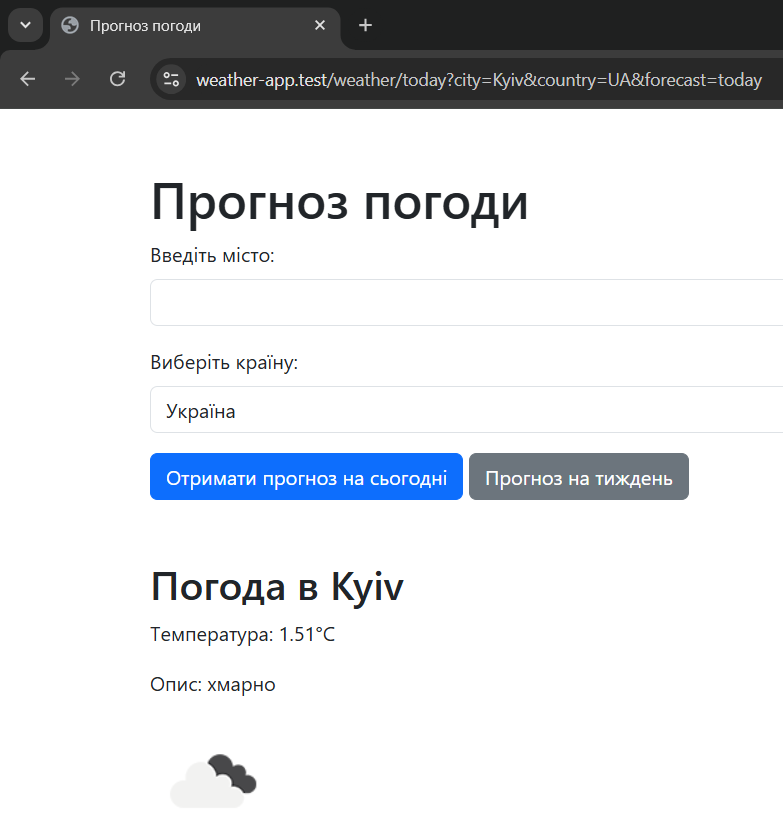
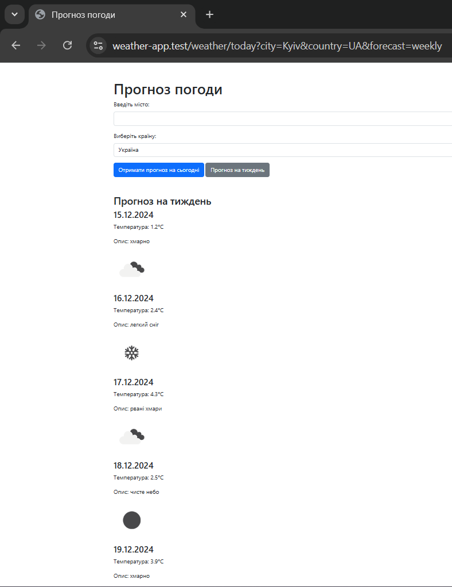
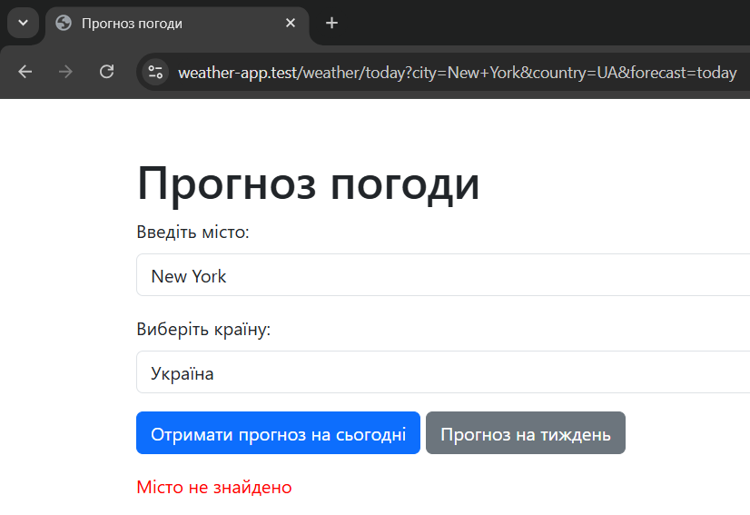

# Weather Forecast 🌤️

This project is a web application to retrieve weather forecasts for today and the upcoming week using the OpenWeather API. Users can enter the city name and select the country for an accurate weather forecast.

## Project Description 🌍

A web application that uses the **OpenWeather API** to get weather forecasts:
- Current weather in the city.
- Forecast for the next 7 days.
- Input for city and country.

## Technologies 💻
- **PHP**, **Laravel**
- **OpenWeather API**
- **Bootstrap**, **HTML/CSS**

## Usage 🔧

<div style="text-align: center;">
  <figure>
    
    <figcaption>Weather display for Kyiv today ☀️</figcaption>
  </figure>

  <figure>
    
    <figcaption>Weather forecast for Kyiv for the week 🌤️</figcaption>
  </figure>

  <figure>
    
    <figcaption>Incorrect city-country match 🌍</figcaption>
  </figure>
</div>

## How to Run the Project 🚀

1. Clone the repository:

    ```bash
    git clone https://github.com/Sashka11111/weather-app.git
    cd weather-app
    ```

2. Install dependencies:

    ```bash
    composer install
    ```

3. Configure the `.env` file (add your API key):

    ```bash
    OPENWEATHER_API_KEY=your_api_key
    ```

4. Visit: [https://weather-app.test](https://weather-app.test)
